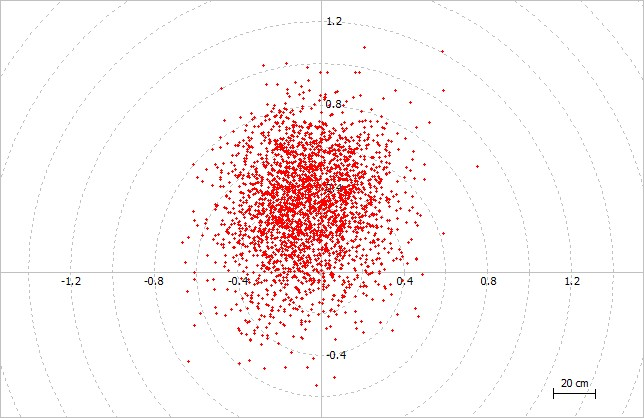
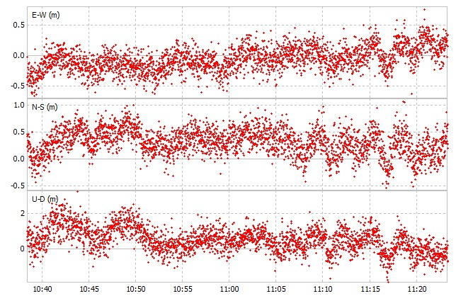

This serves as validation of current (2021) GPS Standard Positioning Service (SPS).

Dual-frequency Ionosphere-free linear combination with broadcast ephemeris and clock ~ < 1-meter: horizontal and < 2-meter: height

  

